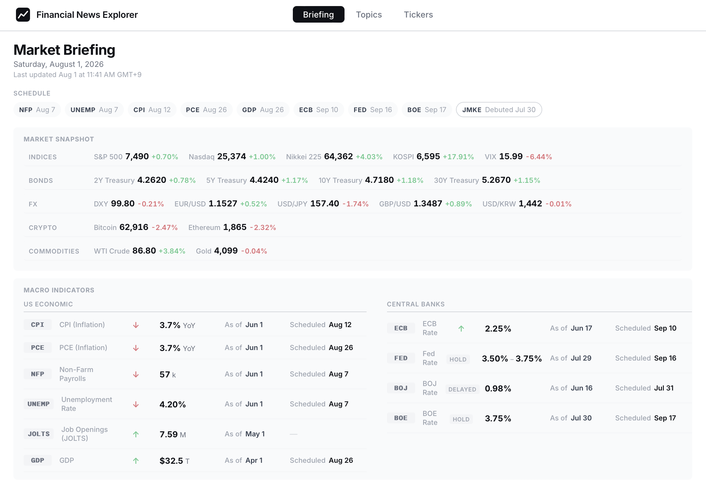
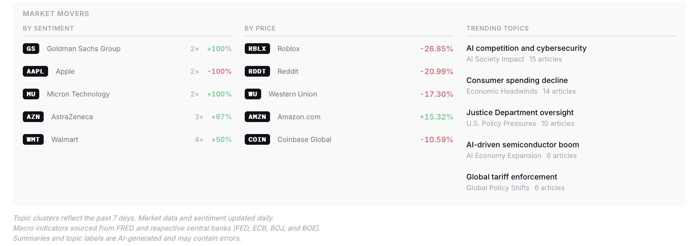
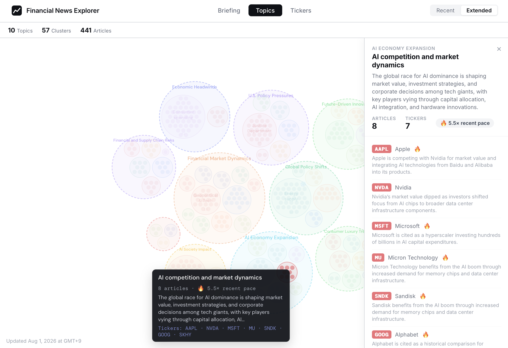
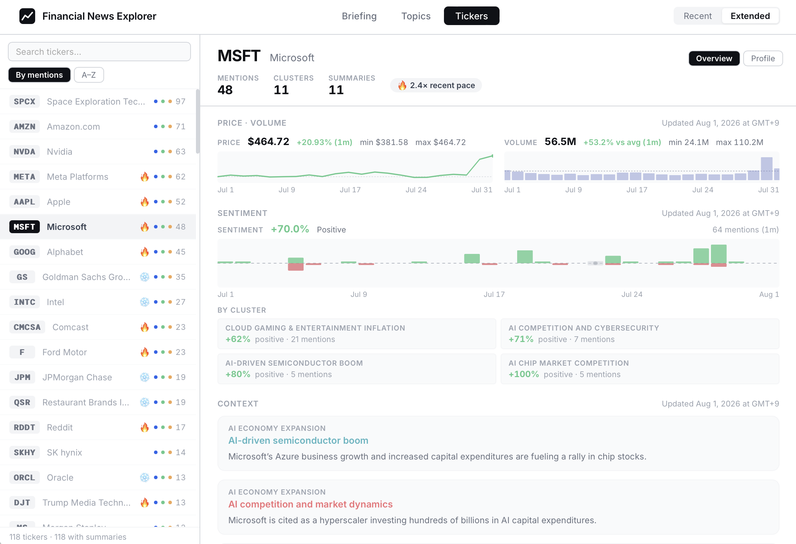
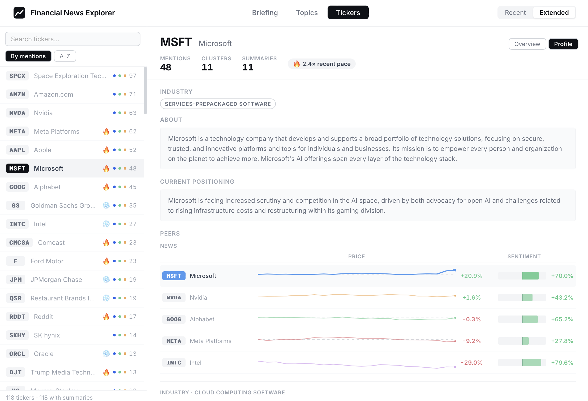
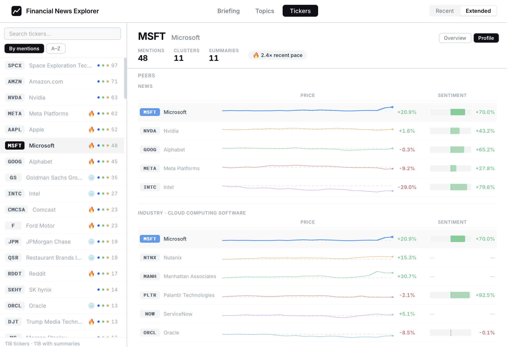

# Financial News Explorer (strat-ui)

Frontend dashboard of news analysis which is backed by data available on [strat-data](https://github.com/staedi/strat-data).

## Overview

The dashboard aims to show several fronts based on the financial news and relevant tickers's prices.

### Market Briefings

Overview of daily market snapshots, i.e., upcoming economic & market events, trending tickers and market indicators.

### News Analysis

News are classified and presented in the form of topic clusters, and available tickers' sentiments and context are analyzed and presented.

### Ticker Analysis

Comprehensive analysis of tickers, i.e., prices, volumes, sentiments, topics and peer comparisons are presented.

## Compositions

The dashboard comprises the following tabs.

### Market Briefings (`Briefing`)

The following information are presented.
- Upcoming events: Upcoming Economic indicator releases, central bank meetings and listing on the markets
- Market Snapshot: Major daily snapshot of market figures (indices, bonds, FX, commodities, crypto, etc.) are presented.
- Macro Indicators: US Economic indicators (e.g., cpi, employment, etc) and central bank rates are presented.
- Market Movers: Trending tickers by topic sentiment and price variances, and Trending topic clusters are presented.

### News Analysis (`Topics`)

News are classified and presented in the form of topic clusters. For each cluster, overall summary and the available tickers' context are analyzed and presented.

### Ticker Analysis (`Tickers`)

Organized by the following sub-tabs.
- Overview: Each ticker's basic charts (i.e., prices and volumes) and news analysis (clusters)
- Profile: Summary of each ticker (i.e., company profile and market positioning) with its comparison to relevant peers
 
## Examples

### Briefings

**Economic and Market Snapshots**

**Market Movers**

### Topics

#### Topic Clusters

### Tickers

#### Ticker Overview

#### Ticker Profile

#### Ticker Peer Comparison

